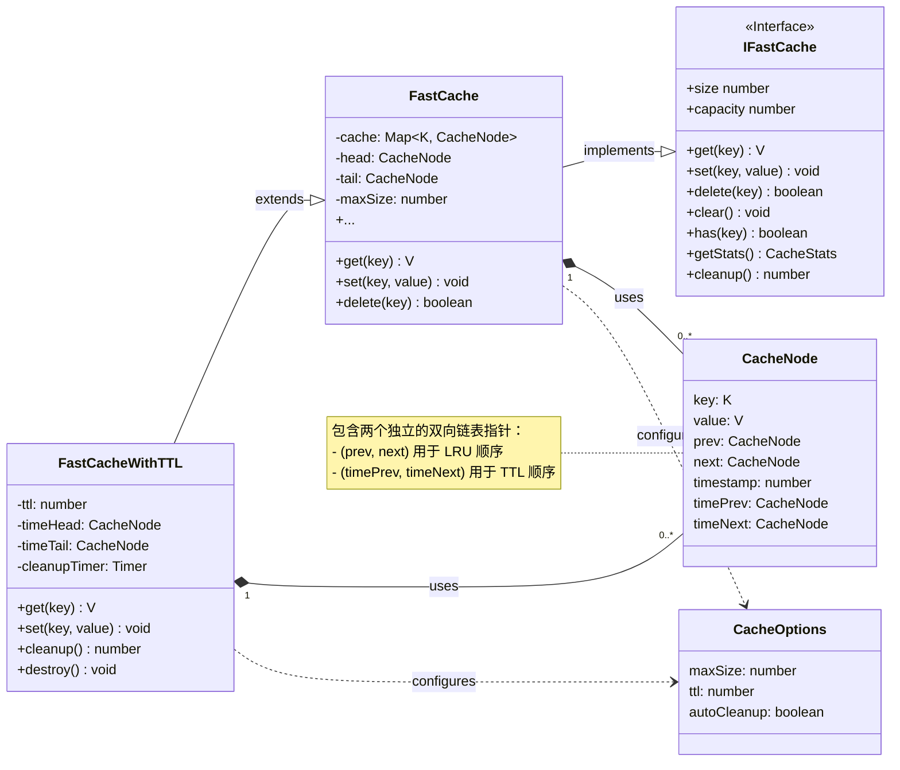
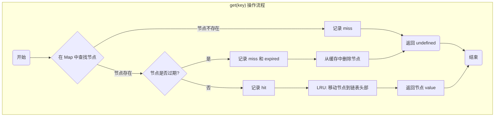

# Fast Map Cache 架构文档

本文档旨在详细介绍 `fast-map-cache` 的内部架构、设计原则和核心工作流程。

## 1. 整体架构

这是一个使用 TypeScript 构建的、面向 Node.js 和浏览器环境的高性能内存缓存库。其架构设计的核心目标是实现极致的性能（核心操作为 O(1) 时间复杂度）和高度的灵活性。

### 1.1. 核心组件

- **`FastCache` (LRU 基础缓存)**
  - **核心数据结构**: 内部采用 `Map` 结构实现 O(1) 复杂度的快速键值查找，同时结合一个**双向链表**来维护数据项的"最近使用顺序"。
  - **LRU 逻辑**: 当一个项目被访问 (`get`) 或更新 (`set`) 时，它在链表中的节点会被移动到链表头部。当缓存已满需要添加新数据时，则会淘汰链表尾部的节点（即最久未使用的项）。`Map` + `双向链表` 是实现 LRU 缓存最经典、性能最好的方式。

- **`FastCacheWithTTL` (带 TTL 的 LRU 缓存)**
  - **继承与扩展**: 此类继承自 `FastCache`，复用了其核心的 LRU 逻辑和数据存储。
  - **TTL 实现机制**: 为了在不牺牲性能的前提下高效地管理过期时间，它精妙地引入了**第二个独立的双向链表**（通过 `CacheNode` 中的 `timePrev` 和 `timeNext` 指针实现）。这个"时间链表"专门负责将所有缓存项按"创建/更新时间"排序。
  - **高效过期清理**: 在清理过期数据时，系统只需从"时间链表"的头部（最老的项目）开始遍历，一旦遇到第一个未过期的项目即可停止。这避免了对整个缓存的全面扫描，使清理操作的效率极高（复杂度为 O(M)，其中 M 是已过期项目的数量，而非缓存总容量）。
  - **懒删除与自动清理**: 系统会在 `get` 或 `has` 操作时"懒惰地"检查并移除过期项。此外，还提供可选的 `autoCleanup` 功能，通过 `setInterval` 定时主动清理。

- **`CacheNode` (统一节点)**
  - 这是内部使用的核心数据单元，一个节点内同时包含了**两套指针**（一套用于 LRU 链表，一套用于 TTL 时间链表）。这种统一的节点设计是整个系统高效运作的关键。

### 1.2. 设计哲学

- **性能优先**: 所有关键的读写操作都为 O(1) 复杂度。
- **类型安全**: 完全使用 TypeScript 实现，提供严格的类型约束。
- **易于使用**: 提供简洁的 API、方便的工厂函数 (`createCache`) 和为常见场景设计的预设配置 (`CachePresets`)。
- **健壮可靠**: 零外部依赖，并细致地处理了各种边界情况和特定于环境的问题（例如 Node.js 的事件循环）。

## 2. 架构类图

下图展示了核心类之间的关系和结构。

## 3.核心操作流程 (`get` 方法)

`FastCacheWithTTL` 中的 `get` 方法是展示其工作原理的一个典型例子，它融合了缓存查找、过期检查和 LRU 更新三个核心逻辑。

